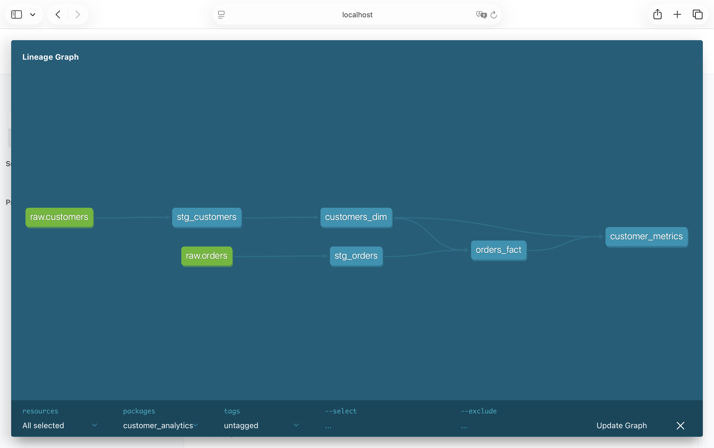

# Customer Analytics Pipeline using Snowflake, dbt & Tableau

## 📌 Project Overview
This project demonstrates an end-to-end analytics workflow starting from raw CSV data to analytics-ready tables and business dashboards.

The goal was to build a clean, scalable customer analytics model using modern data tools and best practices, similar to a real-world analytics engineering setup.

---

## 🛠️ Tech Stack
- **Snowflake** – Cloud data warehouse
- **dbt** – Data transformation, testing, and documentation
- **Tableau** – Business intelligence & visualization
- **SQL** – Data modeling and transformations

---

## 📂 Data Sources
- `customers.csv` – Customer master data  
- `orders.csv` – Transactional order data  

Data is loaded into Snowflake using stages and COPY commands.

---

## 🧱 Data Modeling (dbt)

### Schemas
- **raw** – Raw ingested data
- **staging** – Cleaned and standardized tables
- **analytics** – Business-ready fact & dimension models

### Models
- `stg_customers`
- `stg_orders`
- `customers_dim`
- `orders_fact`
- `customer_metrics`

### Key Features
- Modular dbt models
- Schema-level tests (not null, unique, relationships)
- dbt documentation & lineage graph

📸 *Lineage graph screenshot available in the repository*

---

## 📊 Analytics & KPIs
Key metrics built from analytics models:
- Total Revenue
- Total Orders
- Average Order Value
- Average Revenue per Customer
- Customer Segmentation (High / Medium / Low Value)

---

## 📈 Tableau Dashboard
An interactive dashboard built on Snowflake analytics tables including:
- Customer Overview
- Order Trends
- Top Customers
- Order Details
- KPI Summary
- Customer Value Segmentation

📸 *Dashboard screenshots included in the repository*
[![Dashboard Screenshots]](Images/Tableau)

---

## 🔍 Data Quality & Testing
- Not Null tests
- Uniqueness tests
- Referential integrity tests between fact and dimension tables
- All dbt tests passing successfully

---

## 🚀 What This Project Demonstrates
- End-to-end analytics workflow
- Practical use of dbt in analytics engineering
- Snowflake schema design best practices
- Business-focused dashboarding
- Strong SQL and data modeling fundamentals

---

## 📎 Future Enhancements
- Incremental models
- Snapshotting customer changes
- Advanced customer segmentation
- Deployment using dbt Cloud

---

## 👩‍💻 Author
**Meenakshi Subramaniam**  
Data Analyst | Aspiring Analytics Engineer  
